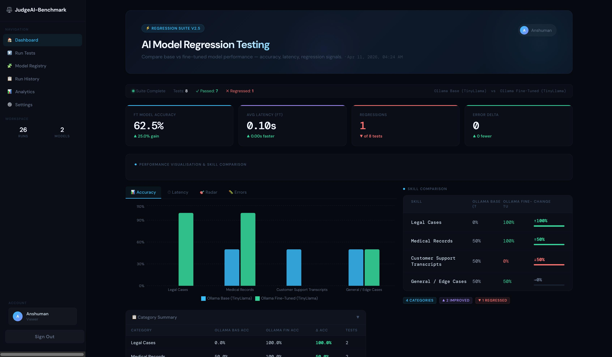
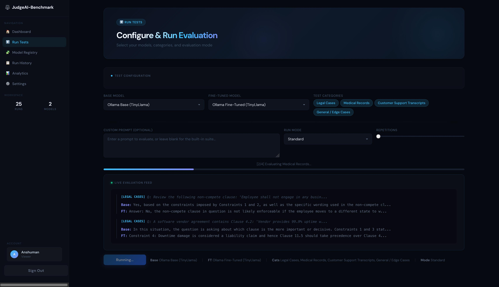
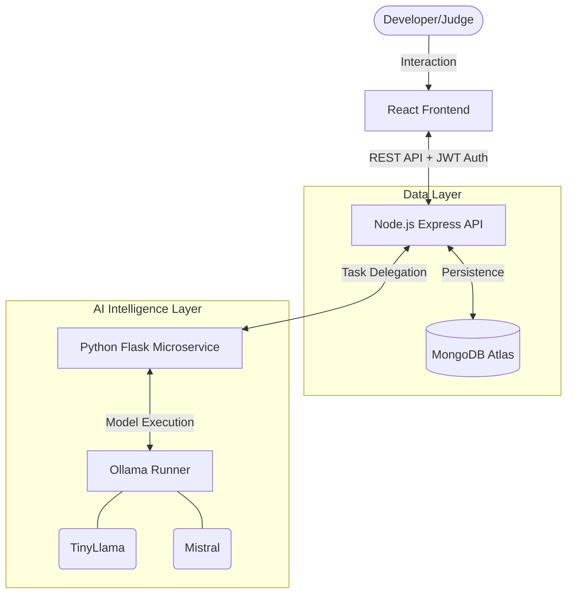

# ⚖️ JudgeAI-Benchmark
### **The Ultimate AI Evaluation & Benchmarking Ecosystem**

**JudgeAI-Benchmark** is a professional, full-stack platform designed to bridge the transparency gap in AI development. It enables developers to compare **Base models** against **Fine-tuned iterations** using a high-fidelity "LLM-as-a-Judge" architecture.

---

## 🌟 Vision & Key Highlights

> "Transparency is the bedrock of reliable AI." – JudgeAI-Benchmark Team

- **🏆 Professional Grading**: Uses advanced models (Mistral/Llama3) to evaluate responses with clinical and legal precision.
- **⚡ On-the-Fly Training**: A "Dynamic Personality" engine that simulates fine-tuning via real-time system instruction injection.
- **🖼️ Deep-Dive Analytics**: Side-by-side comparison modals with monospace typography for pixel-perfect response analysis.
- **🛡️ Regression Guard**: Real-time delta tracking (↑/↓) to ensure your fine-tuning doesn't break basic model capabilities.
- **🔐 Secure Sessions**: Industry-standard JWT (JSON Web Token) authentication to protect model registries and test results.

---

<!-- ## 📸 Visual Tour

### **Interactive Analytics Dashboard**

*Real-time performance metrics, accuracy charts, and skill-based regression analysis.*

### **Side-by-Side Evaluation**

*Compare model responses in real-time with an automated AI Judge grading every output.*

--- -->

## 🚀 Core Features

### 1. **Automated Evaluation (LLM-as-a-Judge)**
Instead of manual grading, JudgeAI-Benchmark uses a "Teacher Model" to grade the "Student Models."
- **Reasoning First**: Every grade comes with a detailed AI-generated explanation.
- **Categorical Benchmarks**: Multi-domain testing across Legal, Medical, and Support transcripts.

### 2. **Dynamic Live Registry**
- Register any local or remote model endpoint.
- Define "Individual Personalities" for each model in the database.
- Instantly switch between models for comparative analysis.

### 3. **High-Fidelity Dashboard**
- **Live Feed**: Watch the AI think and evaluate in real-time.
- **Comparison Modal**: A side-by-side view designed for developers.
- **Status Badges**: Instant visual feedback (PASS/FAIL/DELTA).
- **Protected Routes**: Secure login system with session persistence across page refreshes.

---

## 🛠 Tech Stack

| Layer | Technology | Purpose |
| :--- | :--- | :--- |
| **Frontend** | React.js + Vanilla CSS | Glassmorphic Dashboard & Interactive UI |
| **Backend** | Node.js + Express | API Orchestration & Data Persistence |
| **Database** | MongoDB + Mongoose | Model Registry & Historic Run Tracking |
| **Auth** | JWT (JSON Web Tokens) | Secure Session Management & Protected Routes |
| **AI Engine** | Python Flask | High-speed LLM Inference & Threading |
| **Intelligence** | Ollama | Local model execution (Mistral, TinyLlama) |

---

## 🏗 System Architecture



---

## ⚙️ Quick Start Guide

### 1. Model Preparation
Ensure you have Ollama running and pull the necessary models:
```bash
ollama pull tinyllama
ollama pull mistral
```

### 2. Backend & Intelligence Setup
```bash
# Terminal 1: Node.js API
cd backend && npm install && node server.js

# Terminal 2: Python AI Engine
cd backend/python && pip install flask axios ollama && python server.py
```

### 3. Frontend Activation
```bash
cd frontend && npm install && npm run dev
```

### 🔑 Demo Credentials
Access the platform with these pre-seeded accounts:
- **Username**: `admin@hackmania.io`
- **Password**: `password123`

---

## 📄 License & Contact
All rights reserved. 2026.
Designed for the next generation of AI developers.
