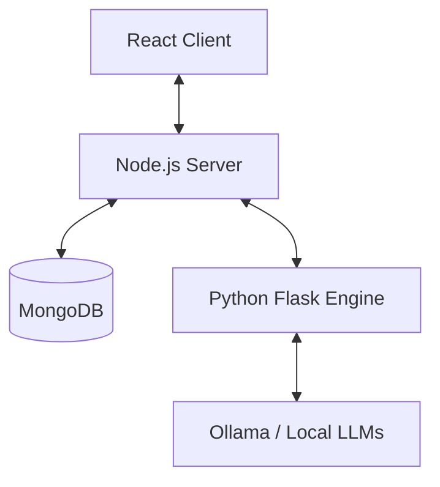

<<<<<<< HEAD
# 🚀 JudgeAI-Benchmark: AI Benchmarking & Evaluation Dashboard
=======
# 🚀 JudgeAI-Benchmark - AI Benchmarking & Evaluation Dashboard
>>>>>>> 95fade70da20994c72d6252d6e9f3bc3132c1660

**JudgeAI-Benchmark** is a high-performance, full-stack platform designed to benchmark and evaluate Large Language Models (LLMs). It provides a side-by-side comparison between Base and Fine-Tuned models using an automated "LLM-as-a-Judge" architecture.


---

## ✨ Key Features

- **🏆 LLM-as-a-Judge**: Leverages advanced models (like Mistral) to evaluate AI responses based on specific professional criteria (Legal, Medical, Support) with detailed reasoning.
- **⚡ Dynamic "Live Training"**: A unique Model Registry where users can "program" model personalities instantly via system instructions without needing offline GPU training.
- **📊 Expansive Analytics**: A professional-grade dashboard featuring:
  - Side-by-side model comparison.
  - Accuracy Delta tracking (↑ Gain / ↓ Drop).
  - Real-time evaluation feed.
  - Deep-dive modals for full test analysis.
- **📚 Categorized Benchmarks**: Pre-seeded datasets for 4 professional domains:
  - **Legal Cases**: Contract interpretation and liability analysis.
  - **Medical Records**: Diagnostic reasoning and risk assessment.
  - **Customer Support**: De-escalation and policy adherence.
  - **General/Edge Cases**: Logic riddles and safety constraint testing.

---

## 🛠 Tech Stack

### Frontend
- **React.js**: Modern component-based architecture.
- **Vanilla CSS**: Premium, glassmorphic UI design.
- **Lucide React**: For sleek, high-end iconography.

### Backend (Node.js)
- **Express.js**: Orchestrates the API and database management.
- **MongoDB**: Persistent storage for models, test cases, and evaluation history.
- **Mongoose**: Robust schema-based modeling.

### AI Engine (Python)
- **Flask**: Microservice to handle AI inference.
- **Ollama**: Local LLM runner for high-speed model execution.
- **Threading**: Optimized ThreadPoolExecutor for concurrent model evaluation.

---

## 🏗 Architecture Overview



---

## 🚀 Getting Started

### 1. Prerequisites
- **Ollama** installed and running (`ollama serve`).
- **Node.js** and **Python 3.x** installed.
- **MongoDB** running locally or via Atlas.

### 2. Setup LLMs
Pull the required models:
```bash
ollama pull tinyllama
ollama pull mistral
```

### 3. Backend Setup (Node.js)
```bash
cd backend
npm install
node server.js
```

### 4. AI Engine Setup (Python)
```bash
cd backend/python
pip install flask axios ollama
python server.py
```

### 5. Frontend Setup
```bash
cd frontend
npm install
npm run dev
```
---

## 📄 License
Project created for **JudgeAI-Benchmark**. All rights reserved. 2026.
